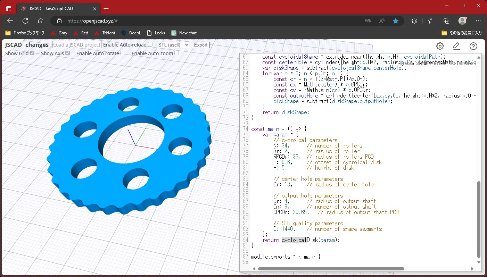

# Cycloidal Drive Generator
Cycloidal Drive Generator for JSCAD  

   

## About 
When creating a cycloidal drive, you will need CAD software that supports the design of cycloidal discs. However, many cost-effective CAD programs do not have such specialized features available.  
The "Cycloidal Disk Generator" was created for the purpose of designing cycloidal discs easily, and it operates within CAD software known as JSCAD.  

JSCAD
https://openjscad.xyz/

## Usage
1. Open the JSCAD website (https://openjscad.xyz/) in your web browser.  
2. Copy and paste the code from CycloidalDisk.js into the script editing pane.  
3. Adjust the parameters, then press Shift+Enter to execute the script, generating 3D data for the cycloidal disk.  
4. Choose your preferred file format, such as STL, and click the "Export" button.  
